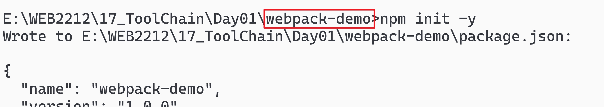
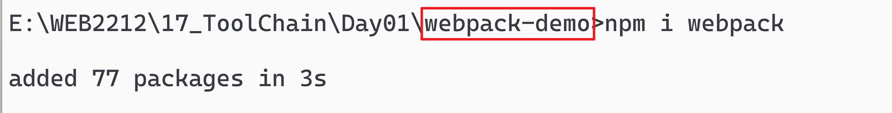

# ToolChain

> 前端工具链

传统的web制作: 书写 HTML CSS JS ...

- 小作坊, 手工业

现代的web制作采用工程化的模式

- 流水线:使用一套规范的工具, 按照固定的流程进行开发
- 有了规范之后, 就可以保障最终产物的质量 和 开发效率

## Webpack

https://webpack.docschina.org/

### 传统开发的问题

关于使用外部的js脚本时, 如何知道引入的脚本 是否依赖其他的脚本呢?

- 例如:引入demo.js之后, 还必须引入其依赖的 jQuery.js文件

- 期望的解决方案: 外部js脚本 能够自己携带自身依赖的其他脚本, 不需要在html中引入

  `自己的事情自己做!!`

关于外部的scss文件

- 在现代的开发中, 大量采用预编译的scss语言. 但是每次都要编译成css再运行.
- `期望`: 能否自动编译?   目前采用插件解决

关于服务器:

- 目前用live server 插件解决

> 最终期望:能否有一个 `一站式`解决方案
>
> - 一款工具, 其中自动提供: 服务器 + scss编译 + 解决脚本的依赖问题
>
> webpack工具诞生!

#### Webpack

是Node.js提供的模块

> 最基本的功能: 支持把Node.js 的模块化语法 转换成 普通的浏览器支持的脚本

1. 创建项目包: `webpack-demo`

2. 初始化成npm管理的环境: `npm init -y`

   

3. 安装webpack模块:`npm i webpack webpack-cli`

   

