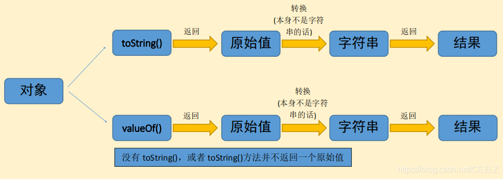
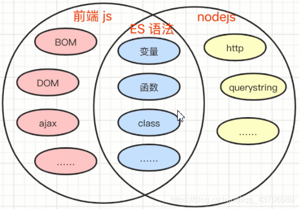
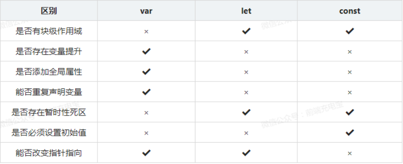

# 第2阶段面试

## 1.JavaScript有哪些数据类型，它们的区别

JavaScript共有八种数据类型，分别是 Undefined、Null、Boolean、Number、String、Object、Symbol、BigInt

这些数据可以分为原始数据类型和引用数据类型：

- 栈：原始数据类型（Undefined、Null、Boolean、Number、String）

- 堆：引用数据类型（对象、数组和函数）

 原始数据类型直接存储在栈（stack）中的简单数据段，占据空间小、大小固定，属于被频繁使用数据，所以放入栈中存储；

 引用数据类型存储在堆（heap）中的对象，占据空间大、大小不固定。如果存储在栈中，将会影响程序运行的性能；引用数据类型在栈中存储了指针，该指针指向堆中该实体的起始地址。当解释器寻找引用值时，会首先检索其在栈中的地址，取得地址后从堆中获得实体。

## 2.数据类型检测的方式有哪些

```js
console.log(typeof 2);        // number

console.log(typeof true);       // boolean

console.log(typeof 'str');      // string

console.log(typeof []);        // object   

console.log(typeof function(){});   // function

console.log(typeof {});        // object

console.log(typeof undefined);    // undefined

console.log(typeof null);       // object
```

## 3. null和undefined区别

首先 Undefined 和 Null 都是基本数据类型，这两个基本数据类型分别都只有一个值，就是 undefined 和 null。

undefined 代表的含义是***\*未定义\****，null 代表的含义是***\*空对象\****。一般变量声明了但还没有定义的时候会返回 undefined，null主要用于赋值给一些可能会返回对象的变量，作为初始化。

undefined 在 JavaScript 中不是一个保留字，这意味着可以使用 undefined 来作为一个变量名，但是这样的做法是非常危险的，它会影响对 undefined 值的判断。我们可以通过一些方法获得安全的 undefined 值，比如说 void 0。

当对这两种类型使用 typeof 进行判断时，Null 类型化会返回 “object”，这是一个历史遗留的问题。当使用双等号对两种类型的值进行比较时会返回 true，使用三个等号时会返回 false。

## 4.为什么0.1+0.2 ! == 0.3，如何让其相等

在开发过程中遇到类似这样的问题：

```js
let n1 = 0.1, n2 = 0.2
console.log(n1 + n2)  // 0.30000000000000004
```

这里得到的不是想要的结果，要想等于0.3，就要把它进行转化：

(n1 + n2).toFixed(2) // 注意，toFixed为四舍五入

toFixed(num) 方法可把 Number 四舍五入为指定小数位数的数字。那为什么会出现这样的结果呢？


计算机是通过二进制的方式存储数据的，所以计算机计算0.1+0.2的时候，实际上是计算的两个数的二进制的和。0.1的二进制是0.0001100110011001100...（1100循环），0.2的二进制是：0.00110011001100...（1100循环），这两个数的二进制都是无限循环的数。那JavaScript是如何处理无限循环的二进制小数呢？

 

一般我们认为数字包括整数和小数，但是在 JavaScript 中只有一种数字类型：Number，它的实现遵循IEEE 754标准，使用64位固定长度来表示，也就是标准的double双精度浮点数。在二进制科学表示法中，双精度浮点数的小数部分最多只能保留52位，再加上前面的1，其实就是保留53位有效数字，剩余的需要舍去，遵从“0舍1入”的原则。

 

根据这个原则，0.1和0.2的二进制数相加，再转化为十进制数就是：0.30000000000000004。

## 5.其他值到数字值的转换规则？

· Undefined 类型的值转换为 NaN。

· Null 类型的值转换为 0。

· Boolean 类型的值，true 转换为 1，false 转换为 0。

· String 类型的值转换如同使用 Number() 函数进行转换，如果包含非数字值则转换为 NaN，空字符串为 0。

**JavaScript中对象到数字的转换经过了如下步骤：**

如果对象具有valueOf()方法，后者返回一个原始值，则js会将其转换为数字(如果需要的话)并返回这个数字。
否则，如果对象具有toString()方法，返回一个原始值(字符串直接量)，则js将其转换为数字类型，并返回这个数字。
否则，js抛出一个类型错误异常。

## 6.其他值到字符串的转换规则？

· null 和 undefined 类型 ，null 转换为 "null"，undefined 转换为 "undefined"，

· boolean 类型，true 转换为 "true"，false 转换为 "false"。

· number 类型的值直接转换，不过那些极小和极大的数字会使用指数形式。


**JavaScript中对象到字符串的转换经过了如下步骤：**

如果对象中有toString()方法，则调用这个方法。如果它返回一个原始值，js将这个值转换为字符串(如果本身不是字符串的话)，并返回这个字符串结果。
如果对象没有toString()方法，或者toString()并不返回一个原始值，那么js会调用valueOf()方法。如果返回值是原始值，js将这个值转换为字符串，并返回字符串结果。
否则，js抛出一个类型错误异常。




## 7.其他值到布尔类型的值的转换规则？

以下这些是假值：

• undefined

• null

• false

• +0、-0 和 NaN

• ‘’

 

假值的布尔强制类型转换结果为 false。从逻辑上说，假值列表以外的都应该是真值。

## 8.|| 和 && 操作符的返回值？

例如：

```js
var a = 2 || 3
var b = 2 && 3
```

|| 和 && 首先会对第一个操作数执行条件判断，如果其不是布尔值就先强制转换为布尔类型，然后再执行条件判断。

 

· 对于 || 来说，如果条件判断结果为 true 就返回第一个操作数的值，如果为 false 就返回第二个操作数的值。

· && 则相反，如果条件判断结果为 true 就返回第二个操作数的值，如果为 false 就返回第一个操作数的值。

 

|| 和 && 返回它们其中一个操作数的值，而非条件判断的结果

## 9.什么是 JavaScript 中的包装类型

在 JavaScript 中，基本类型是没有属性和方法的，但是为了便于操作基本类型的值，在调用基本类型的属性或方法时 JavaScript 会在后台隐式地将基本类型的值转换为对象，如：

```js
const a = "abc";

a.length; // 3

a.toUpperCase(); // "ABC"
```

在访问'abc'.length时，JavaScript 将'abc'在后台转包装成对象，new String('abc')，然后再访问其length属性。

JS中一共有三种包装类型：字符串，布尔，数字


## 10. Node.js是什么？

1. Node.js 是一个基于 Chrome V8 引擎的 JavaScript 运行时
2. nodejs出现之前，js只能在浏览器运行
3. nodejs出现之后，js可以在任何安装nodejs的环境运行

## 11.Node.js和前端JS的区别

- JS运行在客户端浏览器，有多种解释器，存在代码兼容性问题；Node.js运行在服务器端，只有一种解释器，不存在代码兼容性问题
- 两者都有相同的内置对象和自定义对象，有各自的宿主对象
- JS用于操作网页元素，实现用户交互；Node.js用于服务器端开发，例如操作数据库、调用其它的服务器...



## 12. 当前文件和目录的绝对路径如何获取？

1. __filename 获取当前文件
2. __dirname 获取当前路径

## 13.事件循环是什么？

单线程的 Node.js 必须是非阻塞的，以防止线程阻塞在需要很长时间才能完成的任务上，事件循环负责实现这种非阻塞行为，它使用应用程序线程调度挂起的任务。

Node.js 在任务完成时通过回调来处理异步函数返回的响应。与创建任务的事件类似，任务完成后也会发出一个事件。Node.js 将需要处理的事件添加到事件队列。

事件循环对事件队列中的事件进行迭代，并安排何时执行其关联的回调函数。


## 14.ReadFile和createReadStream函数有什么区别？

readFile 函数异步读取文件的全部内容，并存储在内存中，然后再传递给用户。

createReadStream 使用一个可读的流，逐块读取文件，而不是全部存储在内存中。

与 readFile 相比，createReadStream 使用更少的内存和更快的速度来优化文件读取操作。如果文件相当大，用户不必等待很长时间直到读取整个内容，因为读取时会先向用户发送小块内容。

```js
const fs = require("fs");
fs.readFile("test.txt", (err, content) => {
  console.log(content);
});
```

## 15.process.nextTick和setImmediate有什么区别？

传递给 setImmediate 函数的回调将在事件队列上的下一次迭代中执行。

另一方面，回调传递给 process.nextTick 在下一次迭代之前以及程序中当前运行的操作完成之后执行。在应用程序启动时，开始遍历事件队列之前调用它的回调。

因此，回调 process.nextTick 总是在 setImmediate 之前调用。

```js
setImmediate(() => {
  console.log("first");
})
process.nextTick(() => {
  console.log("second");
})
console.log("third");
```


将按顺序输出：

将按顺序输出：

```
third
second
first
```

## 16.说一说常用的npm/npx命令有哪些

```
npm  init  -y      初始化生成一个package.json文件

npm  install  包名称     安装一个指定的包

npm   install     安装package.json中记录的包

npm  install  -g  包名称    全局安装一个包

npx  包名称      临时安装一个包，使用完会自动卸载
```

## 17.说一说git的提交步骤

1.本地初始化git仓库

2.将文件添加到暂存区

3.将暂存区文件提交到git仓库，会姓成一个版本

4.将仓库的版本提交到远程仓库

## 18.GET和POST有什么区别

GET与POST是我们常⽤的两种HTTP Method，⼆者之间的区别主要包括如下五个⽅⾯：

(1). 从功能上讲，GET⼀般⽤来从服务器上获取资源，POST⼀般⽤来更新服务器上的资源；

(2). 从REST服务⾓度上说，GET是幂等的，即读取同⼀个资源，总是得到相同的数据，⽽POST不是幂等的，因

为每次请求对资源的改变并不是相同的；进⼀步地，GET不会改变服务器上的资源，⽽POST会对服务器资源进

⾏改变；

(3). 从请求参数形式上看，GET请求的数据会附在URL之后，即将请求数据放置在HTTP报文的 请求头 中，以?分

割URL和传输数据，参数之间以&相连。特别地，如果数据是英文字⺟/数字，原样发送；否则，会将其编码为

application/x-www-form-urlencoded MIME 字符串(如果是空格，转换为+，如果是中文/其他字符，则直接把

字符串⽤BASE64加密，得出如：%E4%BD%A0%E5%A5%BD，其中％XX中的XX为该符号以16进制表⽰的

ASCII)；⽽POST请求会把提交的数据则放置在是HTTP请求报文的 请求体 中。

(4). 就安全性⽽⾔，POST的安全性要比GET的安全性⾼，因为GET请求提交的数据将明文出现在URL上，⽽且

POST请求参数则被包装到请求体中，相对更安全。

(5). 从请求的⼤⼩看，GET请求的⻓度受限于浏览器或服务器对URL⻓度的限制，允许发送的数据量比较⼩，⽽

POST请求则是没有⼤⼩限制的

## 19.varchar和char有什么区别

区别一，定长和变长
char 表示定长，长度固定，varchar表示变长，即长度可变。char如果插入的长度小于定义长度时，则用空格填充；varchar小于定义长度时，还是按实际长度存储，插入多长就存多长。

因为其长度固定，char的存取速度还是要比varchar要快得多，方便程序的存储与查找；但是char也为此付出的是空间的代价，因为其长度固定，所以会占据多余的空间，可谓是以空间换取时间效率。varchar则刚好相反，以时间换空间。

区别之二，存储的容量不同
对 char 来说，最多能存放的字符个数 255，和编码无关。
而 varchar 呢，最多能存放 65535 个字符。varchar的最大有效长度由最大行大小和使用的字符集确定。整体最大长度是 65,535字节。

## 20.HTTP和HTTPS的区别

**Http**：HTTP协议是Hyper Text Transfer Protocol（超文本传输协议）的缩写。HTTP 协议和 TCP/IP 协议族内的其他众多的协议相同， 用于客户端和服务器之间的通信。

**Https**：HTTPS是HTTP+SSL。HTTPS是一种通过计算机网络进行安全通信的传输协议，经由HTTP进行通信，利用SSL/TLS建立全信道，加密数据包。HTTPS使用的主要目的是提供对网站服务器的身份认证，同时保护交换数据的隐私与完整性。

------

### 区别

- 1、https协议需要到ca申请证书，一般免费证书较少，因而需要一定费用。
- 2、http是超文本传输协议，信息是明文传输，https则是具有安全性的ssl加密传输协议。
- 3、http和https使用的是完全不同的连接方式，用的端口也不一样，前者是80，后者是443。
- 4、http的连接很简单，是无状态的；HTTPS协议是由SSL+HTTP协议构建的可进行加密传输、身份认证的网络协议，比http协议安全。

## 21.HTTP的状态码分类，以及常见的状态码有哪些

| 分类 | 分类描述                                       |
| ---- | ---------------------------------------------- |
| 1**  | 信息，服务器收到请求，需要请求者继续执行操作   |
| 2**  | 成功，操作被成功接收并处理                     |
| 3**  | 重定向，需要进一步的操作以完成请求             |
| 4**  | 客户端错误，请求包含语法错误或无法完成请求     |
| 5**  | 服务器错误，服务器在处理请求的过程中发生了错误 |

常见状态码

| 状态码 | 状态码英文名称        | 中文描述                                                     |
| ------ | --------------------- | ------------------------------------------------------------ |
| 100    | Continue              | 继续。客户端应继续其请求                                     |
| 200    | OK                    | 请求成功。一般用于GET与POST请求                              |
| 302    | Found                 | 临时移动。与301类似。但资源只是临时被移动。客户端应继续使用原有URI |
| 304    | Not Modified          | 未修改。所请求的资源未修改，服务器返回此状态码时，不会返回任何资源。客户端通常会缓存访问过的资源，通过提供一个头信息指出客户端希望只返回在指定日期之后修改的资源 |
| 401    | Unauthorized          | 请求要求用户的身份认证                                       |
| 404    | Not Found             | 服务器无法根据客户端的请求找到资源（网页）。通过此代码，网站设计人员可设置"您所请求的资源无法找到"的个性页面 |
| 500    | Internal Server Error | 服务器内部错误，无法完成请求                                 |
| 502    | Bad Gateway           | 作为网关或者代理工作的服务器尝试执行请求时，从远程服务器接收到了一个无效的响应 |


## 22.谈谈你对作用域链的理解？

简单的说, 作用域是变量与函数的可访问范围.

在es 6之前, 只有全局作用域和函数作用域, es 6中新增了块级作用域, 即两个大括号包裹的内部.

作用域可以嵌套. 在使用变量, 函数时, 对变量和函数的查找, 会先在当前的作用域中进行, 如果找不到的话会继续在包裹当前作用域的上级作用域中查找, 依次往上直到全局作用域. 这个查找过程不能反过来.

## 23.var、let和const的区别

***\*（1）块级作用域：\****块作用域由 { }包括，let和const具有块级作用域，var不存在块级作用域。块级作用域解决了ES5中的两个问题：

· 内层变量可能覆盖外层变量

· 用来计数的循环变量泄露为全局变量

***\*（2）变量提升：\****var存在变量提升，let和const不存在变量提升，即在变量只能在声明之后使用，否在会报错。

***\*（3）给全局添加属性：\****浏览器的全局对象是window，Node的全局对象是global。var声明的变量为全局变量，并且会将该变量添加为全局对象的属性，但是let和const不会。

***\*（4）重复声明：\****var声明变量时，可以重复声明变量，后声明的同名变量会覆盖之前声明的遍历。const和let不允许重复声明变量。

***\*（5）暂时性死区：\****在使用let、const命令声明变量之前，该变量都是不可用的。这在语法上，称为***\*暂时性死区\****。使用var声明的变量不存在暂时性死区。

***\*（6）初始值设置：\****在变量声明时，var 和 let 可以不用设置初始值。而const声明变量必须设置初始值。

***\*（7）指针指向：\****let和const都是ES6新增的用于创建变量的语法。 let创建的变量是可以更改指针指向（可以重新赋值）。但const声明的变量是不允许改变指针的指向。




## 24.Ajax的作用、优缺点

优点：

最大的优点就是页面无需刷新，在页面内与服务器通信，非常好的用户体验。
使用异步的方式与服务器通信，不需要中断操作。
可以把以前服务器负担的工作转嫁给客户端，减轻服务器和带宽，可以最大程度减少冗余请求。
基于标准化的并被广泛支持的技术，不需要下载插件或者小程序。

缺点：

Ajax干掉了Back和History功能，即对浏览器机制的破坏。 无法使用浏览器前进后退。
安全问题：跨站脚本攻击、SQL注入攻击等。
对搜索引擎的支持比较弱。影响SEO

## 25.当用户在浏览器中输入一个网址(URL)到显示一个网页中间经历了什么

1. 现在浏览器器的缓存中查找是否

2. DNS解析，找到服务器

3. 浏览器和WEB服务器建立连接：三次连接

4. 建立连接后，客户端向服务器发起请求

5. 服务器端收到请求后，处理请求，将响应消息发送给客户端

6. 客户端和服务器端断开连接：四次挥手

7. 客户端解析响应的消息，最后渲染成一张网页

## 26.数组中常用的方法（API）有哪些？

toString()/join()/slice()/splice()/reverse()/sort()/push()/pop()/unshift()/shift()

## 27.Date的构造函数接受哪几种形式的参数？

```js
var today = new Date();
var today = new Date(1453094034000); // by timestamp(accurate to the millimeter)
var birthday = new Date('1995-12-17 03:24:00');
var birthday = new Date(1995, 11, 17);
var birthday = new Date(1995, 11, 17, 3, 24, 0);
```

## 28.如何优雅的输出“今天星期几”？

这个题详细对于Date对象稍加了解的人都能答上，但是想要将代码写的真正简明扼要却很考验开发者的功力。

如果你要是回答利用Date对象实例的getDay()方法，然后再通过if或switch等流程控制语句来拼接字符串的话，那确实有点low了。

优雅的方式是：

```js
'今天星期'+'日一二三四五六'.charAt(new Date().getDay())
```

## 29.如何计算两个时间点的时间差

简单的概括的话，就是先取得这两个时间点的时间戳（距离1970年一月一日的标准日期的毫秒数），通过毫秒数和取余的方式来顺序取得天数、小时数、分数。

## 30.说一说冒泡排序，以及具体做法

冒泡排序的英文Bubble Sort:：依次比较两个相邻的子元素，如果他们的顺序错误就把他们交换过来，重复地进行此过程直到没有相邻元素需要交换，即完成整个冒泡。


```js
var arr=[78,6,23,9,45];
//外层循环：比较4轮(循环4次)
for(var i=1;i<arr.length;i++){
  //1 5  4
  //2 5  3
  //3 5  2
  //4 5  1
  //内层循环：比较的次数
  //循环条件：数组长度-i
  for(var j=0;j<arr.length-i;j++){
    //如果当前的元素大于下一个元素
	//则元素位置交换
	//当前元素下标 j  下一个元素j+1
	if(arr[j]>arr[j+1]){
	  var c=arr[j];
	  arr[j]=arr[j+1];
      arr[j+1]=c;
	}
  }
}
console.log(arr);
```

## 31.AJAX的请求步骤

1.创建HTTP请求对象

2.打开服务器的连接

3.发送请求

4.绑定事件，监听服务器端的响应

## 32.去除数组中重复的元素

```js
//方法1
/*
function unique(arr) {
    // 遍历数组,得到每个元素
    for (var i = 0; i < arr.length; i++) {
        // arr[i] 每个元素
        // 用当前遍历的元素和后边的每个元素比较,如果有相同的,则删除
        // 遍历得到后边的每个元素
        for (var j = i + 1; j < arr.length; j++) {
            // arr[j] 后边的每个元素
            if (arr[i] === arr[j]) {
                // 删除后边的元素
                arr.splice(j, 1)
                // 删除后退出去,查看是否再次有重复的
                j--
            }
        }
    }
    // 返回数组
    return arr
}
*/
// 方法2
function unique(arr) {
    // 准备一个新数组
    var arr2 = []
    // 遍历传递的数组
    for (var i = 0; i < arr.length; i++) {
        // arr[i] 每个元素
        // 判断新数组中是否有这个元素,如果没有,则放入到新数组
        if (arr2.indexOf(arr[i]) === -1) {
            arr2.push(arr[i])
        }
    }
    return arr2
}
console.log(unique([1, 1, 1, 2, 2, 3, 3, 4, 4, 5, 5]))
```

