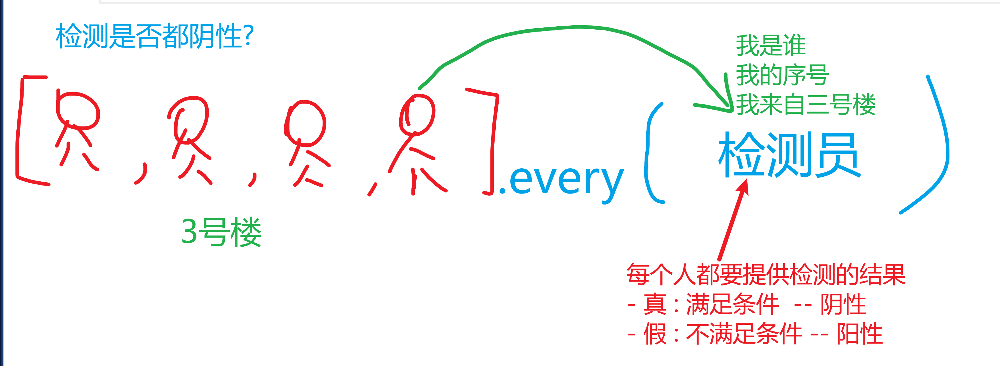

# JSCORE03

## 回顾

函数触发的方式

- call: 函数临时放到对象中执行. 切换函数中的this指向
- apply: 把 数组 转换成 参数列表. 传递到函数中使用
- bind: 函数运行时的 参数 和 所在对象 捆绑在一起. 便于后期调用

构造函数: 用于构建创造对象的函数

- new: 用于辅助构造函数使用, 隐式完成一些代码

  ```js
  this = {}
  this.__proto__ = 构造函数.prototype
  return this
  ```

- prototype: 原型

  - 作用: 节省内存
  - 实现方式:
    - 共享方法存储在 构造函数.prototype 对象中
    - 原型链机制: 对象使用属性时, 自身没有 则 自动到 `__proto__`查找使用

- class:  来自 Java 的class语法, 更容易书写

  ```js
  class 类名{
      // new 运算符触发
      constructor(){}
      
      方法(){}
      
      方法(){}
  }
  ```

ES5 - 严格模式

- 开启方式: `'use strict'`
- 作用: 提供更多的报错. 强制程序员书写更健康的代码

ES6 - let/const

- 带来新的顶级对象, 用于存储自定义的全局变量
- 块级作用域: 用 `{}` 搭配使用
- 声明提升: 存在声明提升 但是 有暂存死区 设定. 在声明行代码运行之前,不允许使用此变量.
  - 利用报错方式, 强制用户 先声明再使用
- const 常量: 声明时必须赋值, 后续无法更改. 更安全

## 模板字符串

```html
<!DOCTYPE html>
<html lang="en">

<head>
  <meta charset="UTF-8">
  <meta http-equiv="X-UA-Compatible" content="IE=edge">
  <meta name="viewport" content="width=device-width, initial-scale=1.0">
  <title>模板字符串 09:13</title>
</head>

<body>
  <script>
    // 传统字符串 用 "" 或 '' 书写

    // 问题1: 不支持换行
    // var html = '<ul>
    //   <li></li>'

    // 问题2: 字符串拼接方案繁琐, 用 + 
    var emp = { ename: "凯凯", age: 19, phone: "10086" }

    // 姓名:xxx, 今年xx岁. 手机号xxxx
    var words = '姓名:' + emp.ename + ', 今年' + emp.age + '岁. 手机号' + emp.phone

    // ES6中的 字符串增强语法 -> 模板字符串
    // 符号: ``
    // 支持换行 和 ${} 在字符串中书写JS代码
    var skills = ['js', 'html', 'css']

    var words = `<ul>
        <li>${skills[0]}</li>
        <li>${skills[1]}</li>
        <li>${skills[2]}</li>
      </ul>`
    console.log(words)
  </script>
</body>

</html>
```

## 箭头函数

```html
<!DOCTYPE html>
<html lang="en">

<head>
  <meta charset="UTF-8">
  <meta http-equiv="X-UA-Compatible" content="IE=edge">
  <meta name="viewport" content="width=device-width, initial-scale=1.0">
  <title>箭头函数 09:24</title>
</head>

<body>
  <script>
    // ES6 提供的 匿名函数语法

    // 之前的匿名函数
    // function() { }
    // 箭头函数
    // () => { }

    // 官方提供语法糖:
    var show = (x) => {
      return 2 * x
    }
    // 糖1: 形参有且只有1个时, 可以省略()
    var show = x => {
      return 2 * x
    }
    // 糖2: 函数体仅有一行时,可以省略 {return }
    var show = x => 2 * x

    console.log(show(10))

    //////////////////////////
    //练习: 尝试用语法糖 简化下方代码
    var a = (y) => { return y * y }
    var a = y => y * y

    var b = (x, y) => { return x + y }
    var b = (x, y) => x + y

    var c = (m, n) => {
      return { m: m, n: n }
    }
    // 问题: 对象的{} 被误认为是 函数的{}, 产生歧义
    // 解决: 用()括起来, 从格式上避免歧义

    // { 属性名: 值 }.  巧合: 值是变量, 变量名和属性名相同
    var c = (m, n) => ({ m: m, n: n })
    // 语法糖: 属性名和变量名一样, 则可以合写
    var c = (m, n) => ({ m, n })

    console.log(
      c(10, 20)
    )

    // 糖:
    var emp = {
      // 可以省略 : function
      // show: function () { alert("Hello!") }
      show() { alert("Hello!") }
    }

    emp.show()
  </script>
</body>

</html>
```

## 箭头函数的this

```html
<!DOCTYPE html>
<html lang="en">

<head>
  <meta charset="UTF-8">
  <meta http-equiv="X-UA-Compatible" content="IE=edge">
  <meta name="viewport" content="width=device-width, initial-scale=1.0">
  <title>箭头函数中的this 09:48</title>
</head>

<body>
  <script>
    // 关于function的this
    // 对象.方法名(): this是前方的对象
    // 方法名(): this是window
    // new 方法名(): this是构造出的 实例对象

    // 关于箭头函数的this
    // 箭头函数没有this, 按照作用域链的就近原则到上级作用域查找
    var emp = {
      ename: "凯凯",
      show() {
        // 箭头函数没有this, 所以使用上级 show 函数中的this
        // emp.show() :  所以 show的this 就是emp
        var a = () => {
          console.log('this:', this)
          console.log(this == emp)
        }
        a()
      }
    }

    emp.show()
  </script>
</body>

</html>
```


## 数组的高阶函数

函数内 使用了其他函数, 就称为高阶函数

- every: 每一个元素都满足条件
- some: 至少有一个元素满足条件
- filter: 把满足条件的元素过滤出来
- map
- forEach
- reduce

## every



```html
<!DOCTYPE html>
<html lang="en">

<head>
  <meta charset="UTF-8">
  <meta http-equiv="X-UA-Compatible" content="IE=edge">
  <meta name="viewport" content="width=device-width, initial-scale=1.0">
  <title>every 10:16</title>
</head>

<body>
  <script>
    // 数组的高阶函数 -- 不属于ES6的新特性
    // 高阶函数: 一个函数的内部使用了其他函数, 常见的带有回调函数的函数;

    console.log(Array.prototype)

    // every: 每一个
    // 数组中, every可以自动遍历数组, 检查每一个元素是否符合指定条件
    // every最终结果: 全真则真, 有假为假;  与 逻辑与操作相似 &&

    var nums = [12, 432, 453, 65, -32, 12, 43]
    // 需求: 判断数组中 是否 所有的/每一个 值都是正数

    // 实参: 要求函数类型
    // every会自动遍历数组, 把数组中的每个元素 都传递给 箭头函数
    var res = nums.every((value, index, array) => {
      // 三个参数: 值, 序号, 数组本身
      // 关系: array[index] == value
      console.log(value, index, array)
      // 返回 判断的结果, 例如 >0 代表正数
      return value > 0
    })

    console.log(res ? '都是正数' : '非都是正数');
  </script>
</body>

</html>
```

练习

```html
<!DOCTYPE html>
<html lang="en">

<head>
  <meta charset="UTF-8">
  <meta http-equiv="X-UA-Compatible" content="IE=edge">
  <meta name="viewport" content="width=device-width, initial-scale=1.0">
  <title>练习 10:36</title>
</head>

<body>
  <script>
    var nums = [12, 43, 54, 6, 65, 23, 54, 33]
    // 1. 判断元素是否都大于10
    var res = nums.every((value, index, array) => {
      return value > 10
    })

    // 形参: 未使用到的可以不写
    var res = nums.every((value) => {
      return value > 10
    })

    // 糖1: 形参只有1个 可以省略()
    var res = nums.every(value => {
      return value > 10
    })
    // 糖2: 方法体只有一行,省略{return }
    var res = nums.every(value => value > 10)

    console.log(res ? '都大于10' : "非都大于10")

    // 2. 判断元素是否都是偶数  对2取余是0
    var res = nums.every((value, index, array) => {
      return value % 2 == 0
    })

    var res = nums.every(value => value % 2 == 0)
    console.log(res ? '都是偶数' : '非都是偶数');
  </script>
</body>

</html>
```

练习

```html
<!DOCTYPE html>
<html lang="en">

<head>
  <meta charset="UTF-8">
  <meta http-equiv="X-UA-Compatible" content="IE=edge">
  <meta name="viewport" content="width=device-width, initial-scale=1.0">
  <title>练习 10:52</title>
</head>

<body>
  <script>
    // 构造员工对象的 构造函数
    function Employee(eid, ename, age, married) {
      this.eid = eid // 员工id
      this.ename = ename
      this.age = age
      this.married = married //婚姻
    }

    var emps = [
      new Employee('0001', '凯凯', 29, false),
      new Employee('0002', '铭铭', 32, true),
      new Employee('0003', '亮亮', 36, true),
      new Employee('0004', '楠姐', 19, false),
      new Employee('0005', '小新', 34, true),
    ]

    console.log(emps)

    // 1. 判断是否所有人都已婚
    var res = emps.every((value, index, array) => {
      // value: Employee类型的对象
      return value.married == true
    })

    var res = emps.every(value => value.married)

    console.log(res ? '都已婚' : '非都已婚');

    // 2. 是否所有人年龄都超过20
    var res = emps.every(value => value.age > 20)
  </script>
</body>

</html>
```

## some

```html
<!DOCTYPE html>
<html lang="en">

<head>
  <meta charset="UTF-8">
  <meta http-equiv="X-UA-Compatible" content="IE=edge">
  <meta name="viewport" content="width=device-width, initial-scale=1.0">
  <title>some 11:23</title>
</head>

<body>
  <script>
    // some: 一些, 至少有一个
    // 只要存在 1个 满足条件的元素, 就算真;  类似逻辑或 ||

    var nums = [21, 3, 34, -54, 65, 34, 43, 6]
    // 判断: 是否存在负数
    var res = nums.some((value, index, array) => {
      return value < 0 // 判断结果: 是否有值是负数
    })

    // 简化
    var res = nums.some(value => value < 0)

    console.log(res ? '存在负数' : '不存在负数')
  </script>
</body>

</html>
```

练习

```js
<!DOCTYPE html>
<html lang="en">

<head>
  <meta charset="UTF-8">
  <meta http-equiv="X-UA-Compatible" content="IE=edge">
  <meta name="viewport" content="width=device-width, initial-scale=1.0">
  <title>练习 11:31</title>
</head>

<body>
  <script>
    function Employee(eid, ename, age, married) {
      this.eid = eid // 员工id
      this.ename = ename
      this.age = age
      this.married = married //婚姻
    }

    var emps = [
      new Employee('0001', '凯凯', 29, false),
      new Employee('0002', '铭铭', 32, true),
      new Employee('0003', '亮亮', 36, true),
      new Employee('0004', '楠姐', 19, false),
      new Employee('0005', '小新', 34, true),
    ]

    // 1. 判断是否有人年龄小于20
    var res = emps.some((value, index, array) => {
      return value.age < 20
    })

    var res = emps.some(value => value.age < 20)

    console.log(res ? '有小于20' : '无小于20');

    // 2. 判断是否有人未婚
    var res = emps.some((value, index, array) => {
      return value.married == false
    })
    // 婚姻状态为 假, 属于满足条件,  非假为真
    var res = emps.some(value => !value.married)
    console.log(res ? '有人未婚' : '都已婚')
  </script>
</body>

</html>
```

## filter

```html
<!DOCTYPE html>
<html lang="en">

<head>
  <meta charset="UTF-8">
  <meta http-equiv="X-UA-Compatible" content="IE=edge">
  <meta name="viewport" content="width=device-width, initial-scale=1.0">
  <title>filter 11:43</title>
</head>

<body>
  <script>
    // filter: 过滤
    // 把数组中满足条件的元素 过滤出来, 形成新的数组
    var nums = [12, 3, 54, 23, 43, 65, 67]
    // 把大于20的元素找出来
    var res = nums.filter((value, index, array) => {
      return value > 20
    })

    var res = nums.filter(value => value > 20)

    console.log(res)
  </script>
</body>

</html>
```

练习

```html
<!DOCTYPE html>
<html lang="en">

<head>
  <meta charset="UTF-8">
  <meta http-equiv="X-UA-Compatible" content="IE=edge">
  <meta name="viewport" content="width=device-width, initial-scale=1.0">
  <title>练习 11:48</title>
</head>

<body>
  <script>
    function Employee(eid, ename, age, married) {
      this.eid = eid // 员工id
      this.ename = ename
      this.age = age
      this.married = married //婚姻
    }

    var emps = [
      new Employee('0001', '凯凯', 29, false),
      new Employee('0002', '铭铭', 32, true),
      new Employee('0003', '亮亮', 36, true),
      new Employee('0004', '楠姐', 19, false),
      new Employee('0005', '小新', 34, true),
    ]

    // 1. 找出年龄大于20的所有人
    var res = emps.filter((value, index, array) => {
      return value.age > 20
    })

    var res = emps.filter(value => value.age > 20)

    console.log(res)

    // 2. 找出所有已婚的人
    var res = emps.filter((value, index, array) => {
      return value.married == true
    })

    var res = emps.filter(value => value.married)

    console.log(res)
  </script>
</body>

</html>
```

## map

```html
<!DOCTYPE html>
<html lang="en">

<head>
  <meta charset="UTF-8">
  <meta http-equiv="X-UA-Compatible" content="IE=edge">
  <meta name="viewport" content="width=device-width, initial-scale=1.0">
  <title>map 14:01</title>
</head>

<body>
  <ul id="box"></ul>

  <script>
    // map: 映射
    // 把数组中的元素 按照规律进行转换, 形成新的数组
    var nums = [1, 2, 3, 4, 5, 6]

    var res = nums.map((value, index, array) => {
      return value * 2
    })

    var res = nums.map(value => value * 2)

    console.log(res)

    var skills = ['html', 'css', 'js', 'dom']

    // 把每个元素放在 li 标签里:   <li>html</li>
    var res = skills.map((value, index, array) => {
      return `<li>${value}</li>`
    })

    var res = skills.map(value => `<li>${value}</li>`)
    // 如何把数组转化/拼接成字符串?  join
    // join的参数, 代表间隔的符号, 默认是 逗号
    console.log(res.join(''))

    box.innerHTML = res.join('')

    console.log(res)
  </script>
</body>

</html>
```

练习

```html
<!DOCTYPE html>
<html lang="en">

<head>
  <meta charset="UTF-8">
  <meta http-equiv="X-UA-Compatible" content="IE=edge">
  <meta name="viewport" content="width=device-width, initial-scale=1.0">
  <title>练习 14:19</title>
</head>

<body>
  <div id="box"></div>
  <div id="box1">
    <!-- <a href="" title=""></a> -->
  </div>

  <script>
    var webs = [
      { title: "百度一下", href: "http://www.baidu.com" },
      { title: "京东", href: "http://www.jd.com" },
      { title: "淘宝", href: "http://www.taobao.com" },
      { title: "斗鱼", href: "http://www.douyu.com" },
    ]

    var res = webs.map(value => `<a href="${value.href}" title="${value.title}">${value.title}</a>`)

    box1.innerHTML = res.join('')


    var names = ['凯凯', '铭铭', '泡泡', '小新']
    // 要求: 把元素放在 button 标签里, 显示到页面上
    var res = names.map(value => `<button>${value}</button>`)

    box.innerHTML = res.join('')
  </script>
</body>

</html>
```

练习

```html
<!DOCTYPE html>
<html lang="en">

<head>
  <meta charset="UTF-8">
  <meta http-equiv="X-UA-Compatible" content="IE=edge">
  <meta name="viewport" content="width=device-width, initial-scale=1.0">
  <title>练习 14:38</title>

  <style>
    table {
      width: 400px;
      border-collapse: collapse;
    }

    td {
      border: 1px solid gray;
      text-align: center;
      padding: 6px;
    }

    thead {
      background-color: #ccc;
    }
  </style>
</head>

<body>
  <table>
    <thead>
      <tr>
        <td>序号</td>
        <td>id</td>
        <td>姓名</td>
        <td>年龄</td>
        <td>婚姻状态</td>
      </tr>
    </thead>
    <tbody id="box">
      <!-- <tr>
        <td></td>
        <td></td>
        <td></td>
        <td></td>
        <td></td>
      </tr> -->
    </tbody>
  </table>

  <script>
    function Employee(eid, ename, age, married) {
      this.eid = eid // 员工id
      this.ename = ename
      this.age = age
      this.married = married //婚姻
    }

    var emps = [
      new Employee('0001', '凯凯', 29, false),
      new Employee('0002', '铭铭', 32, true),
      new Employee('0003', '亮亮', 36, true),
      new Employee('0004', '楠姐', 19, false),
      new Employee('0005', '小新', 34, true),
    ]

    // 数据 -> HTML代码
    var res = emps.map((value, index) => {
      return `<tr>
        <td>${index + 1}</td>
        <td>${value.eid}</td>
        <td>${value.ename}</td>
        <td>${value.age}</td>
        <td>${value.married ? '已婚' : '未婚'}</td>
      </tr>`
    })

    box.innerHTML = res.join('')
  </script>
</body>

</html>
```

## ajax

```html
<!DOCTYPE html>
<html lang="en">

<head>
  <meta charset="UTF-8">
  <meta http-equiv="X-UA-Compatible" content="IE=edge">
  <meta name="viewport" content="width=device-width, initial-scale=1.0">
  <title>AJAX 15:15</title>
</head>

<body>
  <ul id="box"></ul>

  <script>
    // AJAX: 在JS中通过网络请求 从服务器获取数据
    // api.xin88.top : 提供一些练习的接口
    var url = 'https://api.xin88.top/car/news.json'

    const xhr = new XMLHttpRequest()
    xhr.open('get', url)
    xhr.onload = function () {
      var data = JSON.parse(xhr.response)
      console.log(data)

      // 把请求到的数组 list, 转为 li 元素;  <li>标题...<li>
      var res = data.data.list.map(value => {
        return `<li>${value.title}</li>`
      })
      console.log(res)

      box.innerHTML = res.join('')
    }
    xhr.send()
  </script>
</body>

</html>
```

练习

```html
<!DOCTYPE html>
<html lang="en">

<head>
  <meta charset="UTF-8">
  <meta http-equiv="X-UA-Compatible" content="IE=edge">
  <meta name="viewport" content="width=device-width, initial-scale=1.0">
  <title>练习 15:34</title>
</head>

<body>
  <div id="box"></div>

  <script>
    // https://mfresh.xin88.top/data/news_select.php

    // 任务:
    // 1. 利用AJAX 请求接口中的数据
    // 2. 把数据中的内容, 转为 li 标签, 显示出标题
    // 3. 把 li 标签显示到页面上
    var url = 'https://mfresh.xin88.top/data/news_select.php'

    const xhr = new XMLHttpRequest()
    xhr.open('get', url)
    xhr.onload = function () {
      var data = JSON.parse(xhr.response)
      console.log(data)

      var res = data.data.map(value => {
        return `<li>${value.title}</li>`
      })
      console.log(res)

      box.innerHTML = res.join('')
    }
    xhr.send()

    // 步骤跟上一个 几乎一样
  </script>
</body>

</html>
```

## ajax封装

```js
// 需求:
// get(地址, 回调函数)

// callback:回调;  简写: cb
function get(url, cb) {
  var xhr = new XMLHttpRequest()
  xhr.open('get', url)
  xhr.onload = function () {
    var data = JSON.parse(xhr.response)

    cb(data) //传递到回调函数中
  }
  xhr.send()
}
```

## 练习

```html
<!DOCTYPE html>
<html lang="en">

<head>
  <meta charset="UTF-8">
  <meta http-equiv="X-UA-Compatible" content="IE=edge">
  <meta name="viewport" content="width=device-width, initial-scale=1.0">
  <title>练习 15:50</title>

  <!-- 解除防盗链 -->
  <meta name="referrer" content="no-referrer">

  <style>
    #box {
      display: flex;
      flex-wrap: wrap;
      margin: 0;
      padding: 0;
    }

    li {
      list-style: none;
      margin: 0 10px 10px 0;
      box-shadow: 0 0 2px 2px rgba(0, 0, 0, 0.1);
    }

    li>img {
      width: 220px;
      height: 330px;
    }

    li>div {
      padding: 4px;
      text-align: center;
    }

    li>div>span {
      font-size: 0.9em;
      color: orange;
    }
  </style>
</head>

<body>
  <ul id="box">
    <!-- <li>
      
      <div>
        <b></b>
        <span></span>
      </div>
    </li> -->
  </ul>

  <script src="common.js"></script>
  <script>
    // https://api.xin88.top/douban/movies.json

    var url = 'https://api.xin88.top/douban/movies.json'

    get(url, data => {
      console.log(data)

      var res = data.subjects.map(value => {
        return `<li>
          
          <div>
            <b>${value.title}</b>
            <span>${value.rate}</span>
          </div>
        </li>`
      })

      box.innerHTML = res.join('')
    })

    // var xhr = new XMLHttpRequest()
    // xhr.open('get', url)
    // xhr.onload = function () {
    //   var data = JSON.parse(xhr.response)
    //   console.log(data)

    //   var res = data.subjects.map(value => {
    //     return `<li>${value.title}</li>`
    //   })

    //   box.innerHTML = res.join('')
    // }
    // xhr.send()

    // 1. 请求到接口中的数据
    // 2. 转为 li, 内容为 题目 title
    // 3. 显示到页面上
  </script>
</body>

</html>
```


```html
<!DOCTYPE html>
<html lang="en">

<head>
  <meta charset="UTF-8">
  <meta http-equiv="X-UA-Compatible" content="IE=edge">
  <meta name="viewport" content="width=device-width, initial-scale=1.0">
  <title>练习 16:47</title>

  <style>
    #box {
      margin: 0;
      padding: 0;
      display: flex;
      flex-wrap: wrap;
    }

    li {
      list-style: none;
      margin: 0 10px 10px 0;
      box-shadow: 0 0 2px 2px rgba(0, 0, 0, 0.1);
      display: flex;
      flex-direction: column;
      background-color: #14151A;
      padding: 10px;
      border-radius: 4px;
      align-items: center;
    }

    li>b {
      color: white;
      padding: 10px 0;
    }

    li>img {
      width: 100px;
      height: 100px;
    }

    li>span {
      color: #AB934D;
    }
  </style>
</head>

<body>
  <ul id="box">
    <!-- <li>
      
      <b></b>
      <span></span>
    </li> -->
  </ul>

  <script src="common.js"></script>
  <script>
    // https://api.xin88.top/game/items.json

    get('https://api.xin88.top/game/items.json', data => {
      console.log(data)

      var res = data.items.map(value => {
        return `<li>
          
          <b>${value.name}</b>
          <span>${value.price}</span>
        </li>`
      })

      box.innerHTML = res.join('')
    })

    // 1. 利用 common.js 中封装的 get 方法获取数据
    // 2. 在html中书写 ul#box 标签 和 li标签模板
    // 3. 在 js 中, 把请求到的数据 转为 li 代码
    // 4. 把 li 代码显示到 box 标签里
    // 5. 利用CSS进行美化

    // 此接口的图没有防盗链问题
  </script>
</body>

</html>
```


```html
<!DOCTYPE html>
<html lang="en">

<head>
  <meta charset="UTF-8">
  <meta http-equiv="X-UA-Compatible" content="IE=edge">
  <meta name="viewport" content="width=device-width, initial-scale=1.0">
  <title>练习 17:29</title>

  <meta name="referrer" content="no-referrer">

  <style>
    #box {
      display: flex;
      flex-wrap: wrap;
      padding: 0;
      margin: 0;
    }

    li {
      margin: 0 10px 10px 0;
      box-shadow: 0 0 2px 2px rgba(0, 0, 0, 0.1);
      list-style: none;
      display: flex;
      flex-direction: column;
      width: 250px;
    }

    li>b {
      overflow: hidden;
      text-overflow: ellipsis;
      white-space: nowrap;
      padding: 5px 0;
    }

    li>div {
      display: flex;
    }

    li>div>span {
      width: 50%;
    }

    li>img {
      width: 100%;
      height: 150px;
    }
  </style>
</head>

<body>
  <ul id="box">
    <!-- <li>
      
      <b></b>
      <div>
        <span></span>
        <span></span>
      </div>
    </li> -->
  </ul>

  <script src="common.js"></script>
  <script>
    get('https://api.xin88.top/bilibili/news.json', data => {
      console.log(data)

      var res = data.data.archives.map(value => {
        return `<li>
          
          <b>${value.title}</b>
          <div>
            <span>${value.stat.view}</span>
            <span>${value.stat.danmaku}</span>
          </div>
        </li>`
      })

      box.innerHTML = res.join('')
    })

    // https://api.xin88.top/bilibili/news.json

    // 1. 请求接口中的数据
    // 2. html中完成 ul 和 li的代码
    // 3. 数据转html
    // 4. 把 html 添加到页面上
    //  -- 图片有防盗链,需要解除
    // 5. css美化
  </script>
</body>

</html>
```


## 总结

- 模板字符串
  - 支持文本的换行, 特别适合 在JS中书写带有格式的 html 代码
  - 更好的字符串拼接方案 : `${}`
- 箭头函数
  - 格式更简单的匿名函数语法
  - 带有两个语法糖
    - 形参只有一个 省略()
    - 函数体只有一行 省略 {return }
  - this
    - 没有this, 通过作用域链 使用上层作用域的
- 数组高阶函数
  - 高阶函数: 函数中使用了其他函数, 就叫高阶函数
  - every : 判断每个元素都符合条件
  - some : 判断至少一个元素符合条件
  - filter : 把满足条件的元素过滤出来
  - map : 映射. 把每个元素 处理后的返回值, 组合成新的数组


## 作业

https://api.xin88.top/bilibili/recommend.json

- 图片存在防盗链


https://api.xin88.top/bilibili/timeline.jpg

- 图片存在防盗链


